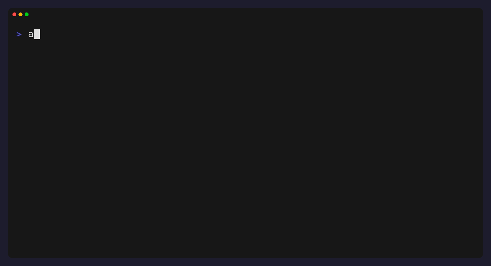

# atlas

<p align="center">
  
</p>


[](https://www.python.org/)

**a tmux-free project switcher/launcher for developers**


## Features

- 🔍 Fuzzy Project Picker (powered by fzf/sk)
- 📦 Per Project config (name, editor, env, hooks, all in a single .atlas.toml file)
- ✅ No Daemon, No **tmux** (No clutter on Tiling WMs)

(+ more to come)

## Why atlas?

If you're a developer, when working on multiple projects, it can be a pain to switch between them, or launch everything needed to run your project; whether it's a REPL, a server, a test suite, editor, etc., it's a pain.

Atlas aims to solve this problem by providing a simple, yet powerful, CLI tool that allows you to switch between (or launch) your projects with ease.

It's designed to be as simple as possible, while still providing the necessary features to make it a powerful tool for developers.

## Install


> [!NOTE]
> atlas requires [`fzf`](https://github.com/junegunn/fzf) or [`skim`](https://github.com/lotabout/skim) to be installed on your system for fuzzy project picking; falls back to numbered list otherwise

### NixOS (flake)
 
```nix
{
  inputs = {
    nixpkgs.url = "github:NixOS/nixpkgs/nixos-unstable";
    atlas = {
      url = "github:ajXeno/atlas";
      inputs.nixpkgs.follows = "nixpkgs";
    };
  };
 
  outputs = { self, nixpkgs, atlas, ... }: {
    nixosConfigurations.yourhost = nixpkgs.lib.nixosSystem {
      system = "x86_64-linux";
      modules = [
        ./configuration.nix
        ({ pkgs, ... }: {
          environment.systemPackages = [ atlas.packages.${pkgs.system}.default ];
        })
      ];
    };
  };
}
```

### Manual

To compile the latest version of atlas, you can use the following commands:

```bash
git clone https://github.com/xeno3dev/atlas.git
cd atlas
python -m pip install .
python -m nuitka --standalone --include-package=atlas --output-dir=build -o atlas src/atlas/__main__.py
```

or if you prefer pipx:
```bash
pipx install git+https://github.com/xeno3dev/atlas.git
```

## Usage

To use atlas, you need to create a `.atlas.toml` file in the root directory of your project. This file contains the project's name, editor, environment variables, and hooks.

Here's an example of a `.atlas.toml` file:

```toml
name = "xenodeal"
editor = "code"

[env]
DATABASE_URL = "postgres://localhost/xenodeal"

[hooks]
on_open = [
    "source .venv/bin/activate",
    "git pull",
]
```

or if you prefer, you can use the `init` command to create a template `.atlas.toml` file.

Once you have created the `.atlas.toml` file, you can use the `atlas add` command to register your project. This command will add your project to the registry, and you can then use `atlas open <project_name>` to open your project.

## Commands
 
| Command | What it does |
| --- | --- |
| `atlas open [name]` | Opens a project. Fuzzy-Picks from your list if `name` is omitted |
| `atlas add [path]` | Registers a directory as a project (defaults to cwd) |
| `atlas list` | Lists all registered projects, sorted by last opened |
| `atlas init` | Scaffolds a `.atlas.toml` in the current directory |
| `atlas forget <name>` | Removes a project from the registry. Files are never touched |
| `atlas which` | Prints the project name for the current directory (scriptable) |

## Roadmap

### Current Release: v0.2.0

- Fuzzy Project Picker
- Per Project Config
- Per Project Hooks (on_open currently)
- Base CLI Commands

### Planned Features for v1.0
- Session Restore (Niri, then others): Snapshot and restore window layout per project
- Background Services: Run dev servers, REPLs, etc. in the background
- `on_close` hooks
- Project Config Validation
- Project Scaffolding: Project Templates + Project Scaffolding, integrated into atlas from the start in one command.
- Git-Awareness in `atlas list`


## License
 
MIT — see [LICENSE](LICENSE).
